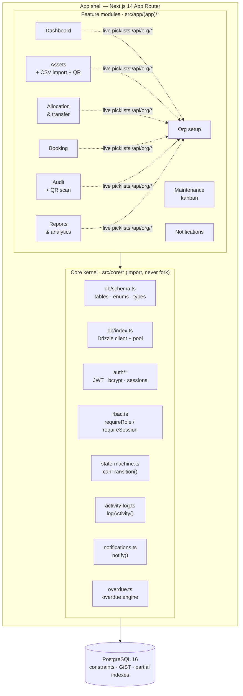
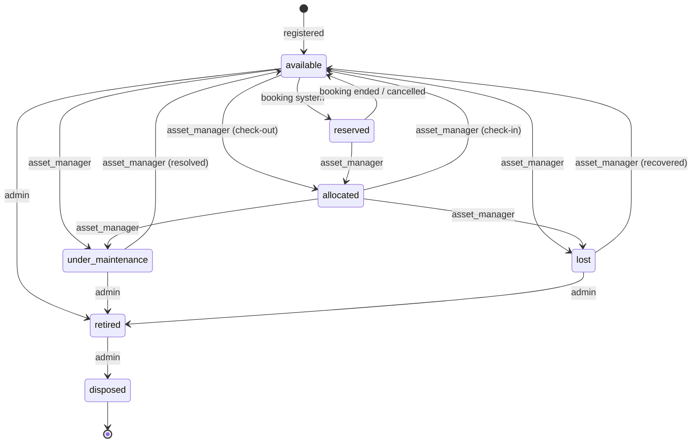

# AssetFlow

**Modular ERP for enterprise asset & resource management.**

AssetFlow tracks the full life of a physical asset — from registration and
allocation, through booking, maintenance and audit, to retirement and disposal —
for an organisation with departments, roles and approval chains. It is a
single Next.js application backed by PostgreSQL, with **no third-party SaaS
dependencies**: auth, notifications, QR generation and analytics are all
self-hosted.

> **AssetFlow follows a modular ERP architecture — each business domain is an
> independent module sharing a core kernel, mirroring how production ERPs
> (Odoo, SAP) are structured.**

The kernel lives in `src/core` (database schema and client, auth, RBAC, the
asset state machine, the activity log and notifications). It is the stable
contract every feature module — assets, allocation, booking, maintenance, audit,
org, dashboard, reports — builds against. Feature modules own their screens and
routes but never redefine the schema, sessions or lifecycle rules. Change a
business rule once, in the kernel, and every module inherits it.

---

## Table of contents

- [Architecture](#architecture)
- [Data model (ERD)](#data-model-erd)
- [Asset lifecycle state machine](#asset-lifecycle-state-machine)
- [Business rules enforced at the database level](#business-rules-enforced-at-the-database-level)
- [Zero external APIs](#zero-external-apis)
- [Setup](#setup)
- [Features — the ten screens](#features--the-ten-screens)
- [Tech stack](#tech-stack)
- [Project layout](#project-layout)
- [Conventions for feature modules](#conventions-for-feature-modules)

---

## Architecture

Every feature module depends *inward* on the kernel and never on another
module. The kernel knows nothing about any specific feature — it only exposes
the shared contract (schema, sessions, RBAC, the state machine, the audit log
and notifications). This is the same dependency direction that keeps a real
ERP's modules swappable.



Notes:

- **One-way dependency.** Modules import from `@/core/*`; the kernel imports
  nothing from modules. Deleting a feature never breaks the kernel.
- **Live picklists.** Every department / category / employee / resource
  dropdown across allocation, assets, booking and audit is populated at request
  time from `/api/org/*` or a server-side DB query — there are no hardcoded
  lists of orgs, people or categories anywhere in the UI.
- **DB is the last line of defence.** Application guards (`requireRole`,
  `canTransition`) are backed by hard constraints in Postgres, so a bug in a
  module still can't double-book a room or double-allocate an asset.

---

## Data model (ERD)

All foreign keys are `ON DELETE RESTRICT` — nothing is silently orphaned. The
schema is defined once in [`src/core/db/schema.ts`](src/core/db/schema.ts) and
imported everywhere; cross-column and exclusion constraints that Drizzle's DSL
can't express live in [`drizzle/0001_constraints.sql`](drizzle/0001_constraints.sql).

```mermaid
erDiagram
    DEPARTMENTS  ||--o{ USERS               : "employs"
    USERS        ||--o{ DEPARTMENTS         : "heads"
    DEPARTMENTS  ||--o{ DEPARTMENTS         : "parent of"
    ASSET_CATEGORIES ||--o{ ASSETS          : "classifies"
    ASSETS       ||--|| ASSET_ATTRIBUTES    : "custom-field values"

    ASSETS       ||--o{ ALLOCATIONS         : "held via"
    USERS        ||--o{ ALLOCATIONS         : "holder (user)"
    DEPARTMENTS  ||--o{ ALLOCATIONS         : "holder (dept)"

    ASSETS       ||--o{ TRANSFER_REQUESTS   : "transferred"
    USERS        ||--o{ TRANSFER_REQUESTS   : "from / to / decided_by"

    ASSETS       ||--o{ BOOKINGS            : "booked"
    USERS        ||--o{ BOOKINGS            : "booked_by"

    ASSETS       ||--o{ MAINTENANCE_REQUESTS: "serviced"
    USERS        ||--o{ MAINTENANCE_REQUESTS: "raised_by / decided_by"

    DEPARTMENTS  ||--o{ AUDIT_CYCLES        : "scoped to"
    AUDIT_CYCLES ||--o{ AUDIT_CYCLE_AUDITORS: "staffed by"
    USERS        ||--o{ AUDIT_CYCLE_AUDITORS: "auditor"
    AUDIT_CYCLES ||--o{ AUDIT_ITEMS         : "checklist"
    ASSETS       ||--o{ AUDIT_ITEMS         : "verified"
    USERS        ||--o{ AUDIT_ITEMS         : "auditor"

    USERS        ||--o{ NOTIFICATIONS       : "recipient"
    USERS        ||--o{ ACTIVITY_LOGS       : "actor"

    USERS {
        int    id PK
        text   name
        text   email UK
        text   password_hash
        enum   role "admin·asset_manager·dept_head·employee"
        int    department_id FK
        enum   status "active·inactive"
    }
    DEPARTMENTS {
        int    id PK
        text   name
        int    head_id FK
        int    parent_id FK
        enum   status
    }
    ASSET_CATEGORIES {
        int    id PK
        text   name
        jsonb  custom_fields "e.g. { warranty_months: number }"
    }
    ASSETS {
        int     id PK
        text    tag UK "AF-0001 (sequence default)"
        text    name
        int     category_id FK
        text    serial_number
        date    acquisition_date
        numeric acquisition_cost
        text    location
        enum    status "7-state lifecycle"
        bool    is_bookable
        text    qr_data
    }
    ASSET_ATTRIBUTES {
        int    asset_id PK "FK → assets"
        jsonb  values
    }
    ALLOCATIONS {
        int    id PK
        int    asset_id FK
        int    holder_user_id FK "XOR"
        int    holder_department_id FK "XOR"
        date   expected_return_date
        ts     returned_at
        enum   status "active·returned"
    }
    TRANSFER_REQUESTS {
        int    id PK
        int    asset_id FK
        int    from_user_id FK
        int    to_user_id FK
        text   reason
        enum   status "requested·approved·rejected"
        int    decided_by FK
    }
    BOOKINGS {
        int    id PK
        int    asset_id FK
        int    booked_by FK
        ts     starts_at
        ts     ends_at
        enum   status "upcoming·ongoing·completed·cancelled"
    }
    MAINTENANCE_REQUESTS {
        int    id PK
        int    asset_id FK
        int    raised_by FK
        text   issue
        enum   priority "low·medium·high"
        enum   status "pending·approved·rejected·assigned·in_progress·resolved"
        text   technician_name
        int    decided_by FK
    }
    AUDIT_CYCLES {
        int    id PK
        text   name
        int    scope_department_id FK
        text   scope_location
        date   start_date
        date   end_date
        enum   status "open·closed"
    }
    AUDIT_CYCLE_AUDITORS {
        int    cycle_id PK "FK"
        int    user_id PK "FK"
    }
    AUDIT_ITEMS {
        int    id PK
        int    cycle_id FK
        int    asset_id FK
        text   expected_location
        enum   verification "pending·verified·missing·damaged"
        int    auditor_id FK
    }
    NOTIFICATIONS {
        int    id PK
        int    user_id FK
        enum   category "alert·approval·booking"
        text   message
        text   entity_ref "e.g. asset:AF-0114"
        ts     read_at
    }
    ACTIVITY_LOGS {
        int    id PK
        int    actor_id FK "null = system"
        text   action "verb.scoped e.g. asset.allocated"
        text   entity_type
        int    entity_id
        jsonb  before
        jsonb  after
    }
    STATE_TRANSITIONS {
        int    id PK
        enum   from_state
        enum   to_state
        enum   required_role "null = any authenticated"
    }
```



The `state_transitions` table has no foreign keys — it is a queryable mirror of
the canonical `ASSET_STATE_TRANSITIONS` map in code (see below), seeded so the
lifecycle rules are also joinable in SQL for reporting.

---

## Asset lifecycle state machine

An asset's `status` may only change along the legal edges below. The map is
defined once in [`src/core/state-machine.ts`](src/core/state-machine.ts) as
`ASSET_STATE_TRANSITIONS`; **every** module validates a status change with
`canTransition(from, to, role)` *before* writing it (allocation check-out/in,
maintenance approve/resolve, audit close→lost). No module writes
`assets.status` directly. Labels on the edges show the role that may perform the
move — `admin` may always perform any legal move.



Because the same map is both enforced in code (`canTransition`) and stored in a
table (`state_transitions`), the rules are impossible to drift: the seed writes
the table from the code map, and the reports/joins read the table.

---

## Business rules enforced at the database level

Application-layer guards are the first line of defence; these Postgres
constraints are the last. Even a buggy or malicious write can't violate them.
They live in [`drizzle/0001_constraints.sql`](drizzle/0001_constraints.sql).

**1. No double-booking — GiST exclusion constraint.** Two live
(`upcoming`/`ongoing`) bookings of the same asset can never overlap in time.
Cancelled/completed bookings are exempt, so history never blocks a new booking.
The booking UI catches the resulting error and draws the clash as a red block —
the guarantee itself is in the database.

```sql
CREATE EXTENSION IF NOT EXISTS btree_gist;

ALTER TABLE bookings ADD CONSTRAINT no_overlapping_bookings
  EXCLUDE USING gist (asset_id WITH =, tstzrange(starts_at, ends_at) WITH &&)
  WHERE (status IN ('upcoming','ongoing'));
```

**2. No double-allocation — partial unique index.** An asset can have at most
one `active` allocation at a time; returned allocations are excluded, so an
asset's full allocation history is preserved without blocking re-allocation.

```sql
CREATE UNIQUE INDEX one_active_allocation
  ON allocations (asset_id) WHERE status = 'active';
```

**3. State-machine-validated lifecycle.** Every asset-status change is checked
against `canTransition()` in code, and the legal map is mirrored into the
`state_transitions` table so the rules are auditable in SQL. Illegal moves
(e.g. `disposed → allocated`) simply don't exist as edges.

```sql
-- The legal lifecycle, seeded from ASSET_STATE_TRANSITIONS (queryable mirror):
SELECT from_state, to_state, required_role FROM state_transitions;
```

Supporting invariants in the same file:

```sql
-- An allocation is held by exactly one party: a user XOR a department.
ALTER TABLE allocations ADD CONSTRAINT allocation_single_holder
  CHECK (num_nonnulls(holder_user_id, holder_department_id) = 1);

-- A booking must end after it starts (also keeps the tstzrange non-empty).
ALTER TABLE bookings ADD CONSTRAINT booking_ends_after_start
  CHECK (ends_at > starts_at);

-- Human-readable asset tags auto-generate as AF-0001, AF-0002, …
ALTER TABLE assets ALTER COLUMN tag
  SET DEFAULT 'AF-' || lpad(nextval('asset_tag_seq')::text, 4, '0');
```

All foreign keys are `ON DELETE RESTRICT`.

---

## Zero external APIs

Everything runs self-hosted. There are no third-party SaaS calls, API keys or
outbound network dependencies at runtime — the whole system works air-gapped
behind `docker compose`.

| Concern | How AssetFlow does it | What it replaces |
| --- | --- | --- |
| **Authentication** | `jose`-signed JWT (HS256) in an httpOnly cookie; `bcryptjs` password hashing — [`src/core/auth`](src/core/auth) | Auth0 / Clerk / NextAuth |
| **Password reset** | Short-lived signed token surfaced in-app — [`src/app/api/auth/reset-password`](src/app/api/auth/reset-password) | SendGrid / SES email |
| **Notifications** | Rows in the `notifications` table read by the in-app centre — [`src/core/notifications.ts`](src/core/notifications.ts) | Push / email provider |
| **QR codes** | Local generation (`qrcode`) of a self-describing payload `assetflow:asset:AF-0114`, scanned in-browser (`jsQR`) — [`src/lib/qr.ts`](src/lib/qr.ts) | QR-as-a-service |
| **File storage** | Photos written to local disk — [`src/lib/uploads.ts`](src/lib/uploads.ts) | S3 / Cloudinary |
| **CSV import / export** | Client-side parser and exporter — [`import-csv-modal.tsx`](src/app/(app)/assets/_components/import-csv-modal.tsx), [`src/lib/csv.ts`](src/lib/csv.ts) | External ETL |
| **Charts & analytics** | `recharts` + hand-rolled heatmap, computed from live queries — [`reports`](src/app/(app)/reports) | BI SaaS |
| **Database** | PostgreSQL 16 in Docker | — |

---

## Setup

**Requirements:** Node 20+, Docker.

```bash
# 1. Install dependencies
npm install

# 2. Configure environment
cp .env.example .env         # then set a real JWT_SECRET: openssl rand -base64 48

# 3. Start Postgres 16
docker compose up -d

# 4. Apply migrations (Drizzle schema + hand-written constraints)
npm run db:migrate

# 5. Seed the demo org
npm run seed                 # alias of npm run db:seed

# 6. Run the app
npm run dev                  # http://localhost:3000
```

**One-liners:**

```bash
npm run db:setup     # migrate + seed (fresh clone)
npm run reset:demo   # migrate + re-seed — resets the demo cleanly before a run
```

The seed is idempotent (it truncates then re-inserts), so `reset:demo` is safe
to run repeatedly. **Health check:** `GET /api/health` returns `200` with
`{ status: "ok", db: "up", latencyMs }` when Postgres is reachable, `503`
otherwise — handy for the `docker compose` healthcheck or a quick smoke test.

**Demo logins after seeding** (non-admins: `password123`):

| Email | Password | Role |
| --- | --- | --- |
| admin@assetflow.com | `admin123` | admin |
| aditi.rao@assetflow.com | `password123` | dept_head (Engineering) |
| rohan.mehta@assetflow.com | `password123` | dept_head (Facilities) |
| vikram.nair@assetflow.com | `password123` | asset_manager |
| priya.shah@assetflow.com | `password123` | employee (holds MacBook AF-0114) |

The seed loads a complete story so every screen is alive on first load: ~44
assets across Electronics / Furniture / Vehicles, a MacBook allocated to Priya
Shah, a projector under maintenance, a conference room with a booking at 09:00
today, **an already-overdue allocation** (so the dashboard banner and overdue
alert show immediately), maintenance requests in **all five kanban columns**, an
open audit cycle with a missing-asset discrepancy, and a populated activity feed
and notification centre.

---

## Features — the ten screens

| # | Screen | Route | What it does |
| --- | --- | --- | --- |
| 1 | **Authentication** | `/login`, `/signup`, `/forgot-password` | JWT session bootstrap. Self-service signup only ever creates an `employee`. |
| 2 | **Dashboard** | `/dashboard` | "Today's Overview": six live KPI counts, an overdue banner, and a recent-activity feed from the audit log. |
| 3 | **Org setup** | `/org` | **Admin-only.** Departments (with hierarchy + heads), asset categories with JSON custom-field definitions, and employee roles. |
| 4 | **Assets** | `/assets`, `/assets/[id]` | Registration + directory with live search and category/status/department filters; detail page with a printable QR, custom fields, and full allocation + maintenance history. Includes **CSV bulk import**. |
| 5 | **Allocation & transfer** | `/allocation` | Assign to a user or department, an approvals queue for transfer requests, check-in with condition notes, and overdue flags. |
| 6 | **Booking** | `/booking` | Day-view resource calendar. Overlapping slots are **rejected by the database** and drawn as a dashed-red conflict block. |
| 7 | **Maintenance** | `/maintenance` | Drag-and-drop kanban (Pending → Approved → Technician Assigned → In Progress → Resolved) that **auto-flips the asset's status** (`under_maintenance` / `available`) through the state machine. |
| 8 | **Audit** | `/audit` | Audit cycles scoped by department/location, a verification checklist, **QR scan-to-audit** from the device camera, and an auto-generated discrepancy report that can mark assets `lost` on close. |
| 9 | **Reports & analytics** | `/reports` | Utilization and maintenance charts, most-used / idle-asset lists, a lifecycle watch-list, a booking heatmap, and CSV export. |
| 10 | **Notifications & activity** | `/notifications` | Two tabs — the personal notification centre (alert / approval / booking) and the org-wide activity log. |

**Cross-cutting features**

- **Overdue engine** — [`src/core/overdue.ts`](src/core/overdue.ts): an idempotent
  sweep (`/api/overdue`) that flags allocations and bookings past their due date,
  writing deduplicated `alert` notifications and activity-log entries as the
  system actor.
- **Cmd+K command palette** — [`command-palette.tsx`](src/app/(app)/_components/command-palette.tsx):
  global fuzzy search across assets, people and resources (`cmdk` + `/api/search`).
- **QR everywhere** — local generation on the asset page and camera-based
  scanning in the audit flow, all on a self-describing `assetflow:asset:<tag>`
  payload.
- **Full audit trail** — every state-mutating action across every module calls
  `logActivity`, and key events fan out through `notify` — so the dashboard feed,
  Screen 10, and the compliance history are always complete.

---

## Tech stack

| Layer | Choice | Notes |
| --- | --- | --- |
| Framework | **Next.js 14** (App Router) | Server Actions + Route Handlers; RSC data loaders per screen |
| Language | **TypeScript** (strict) | Types inferred from the Drizzle schema, shared kernel-wide |
| Database | **PostgreSQL 16** | GiST exclusion + partial-unique constraints do the heavy lifting |
| ORM / migrations | **Drizzle ORM** + **drizzle-kit** | `src/core/db`; hand-written SQL for constraints Drizzle can't express |
| Auth | **jose** (JWT) + **bcryptjs** | httpOnly cookie sessions; no external identity provider |
| Validation | **zod** | Every server action and auth route validates its input |
| UI | **Tailwind CSS** + **shadcn/ui** (Radix) | Dark theme, shared component library in `src/components` |
| Charts | **recharts** | Bar/line charts; heatmap hand-rolled |
| Drag & drop | **@dnd-kit/core** | Maintenance kanban |
| QR | **qrcode** (gen) + **jsqr** (scan) | Fully local |
| Command palette | **cmdk** | Cmd+K global search |

---

## Project layout

```
src/core/                 ← the kernel (this is the contract; import, don't fork)
  db/schema.ts            ← all tables, enums, and inferred types
  db/index.ts             ← Drizzle client over a pg Pool (db, pool, DbExecutor)
  auth/                   ← passwords, JWT tokens, cookie sessions, signup/login/reset
  rbac.ts                 ← hasRole / requireRole / requireSession guards
  state-machine.ts        ← canTransition + ASSET_STATE_TRANSITIONS (asset lifecycle)
  activity-log.ts         ← logActivity(...) audit-trail writer
  notifications.ts        ← notify(...) / notifyMany(...) in-app notification writer
  overdue.ts              ← overdue-allocation / -booking engine
  errors.ts               ← ApiError family + toErrorResponse for routes
src/app/(app)/            ← feature modules, one folder per screen (page + _data + actions)
src/app/api/              ← auth, org picklists (/api/org/*), health, overdue, search
src/components/           ← shared UI (data-table, kpi-card, status-pill, modal, …)
src/lib/                  ← qr, csv, uploads, utils
drizzle/                  ← migrations (0001_constraints.sql is hand-written SQL)
scripts/seed.ts           ← demo org seed (npm run seed)
```

---

## Conventions for feature modules

These are the rules the kernel exists to enforce. A module that follows them
gets RBAC, audit logging, notifications and lifecycle safety for free.

- **Import, don't fork.** Take tables and types from `@/core/db/schema` — never
  redeclare them.
- **Guard every mutation** with `requireRole` / `requireSession`.
- **Validate every status change** with `canTransition` before writing
  `assets.status` — never write it directly.
- **Wrap multi-step writes** in `db.transaction`, and pass the transaction into
  `logActivity` / `notify` so the side effects commit (or roll back) atomically
  with the change they record.
- **Populate dropdowns live** from `/api/org/*` or a server query — never
  hardcode lists of departments, people, categories or locations.
- **Self-service signup only ever creates `employee` users**; role elevation is
  an admin action in Org setup.
